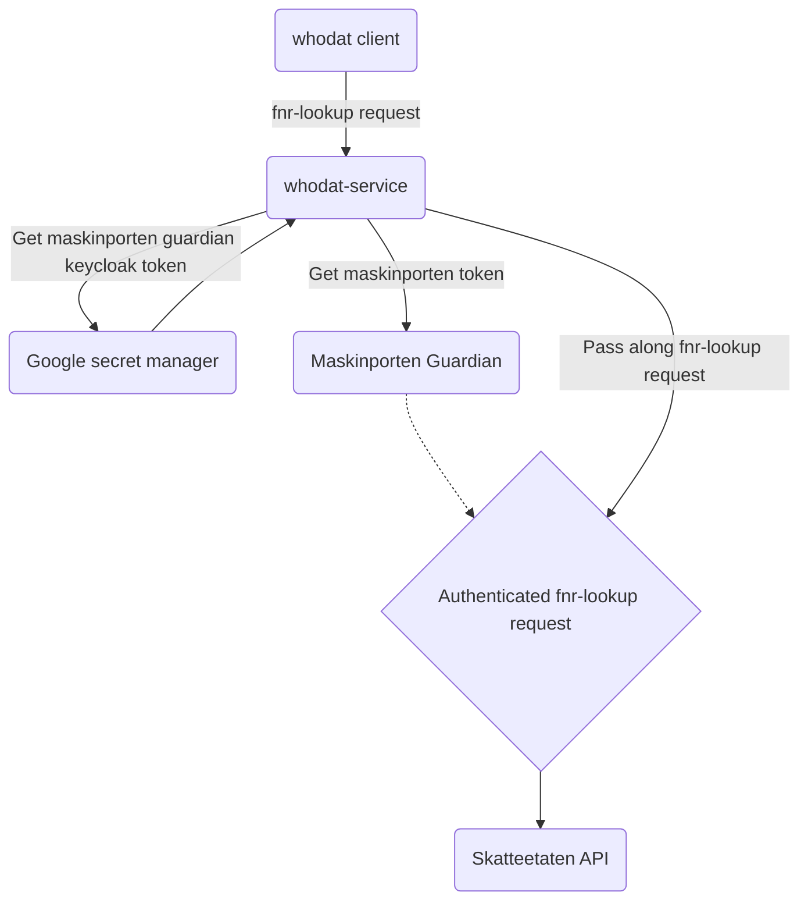

# Whodat-service

A service that proxies requests to the Norwegian Tax Administration's API for looking up national
identity numbers.

## Technologies

The whodat-service is built using the Kotlin language and the Micronaut REST API framework.

## Concurrency model

Micronaut uses Netty under the hood which is based on an event loop model. For whodat-service we've
configured two seperate event loops. One default event loop where controller requests and middleware are processed
and a separate event loop for http clients. Furthermore we use [Kotlin Coroutines](https://kotlinlang.org/docs/coroutines-overview.html) for asyncronous calls. This is supported through the micronaut kotlin runtime which ensures that control is yielded back to the netty event loop when a function is suspended. It's important to ensure that event loops aren't blocked. If you need
to make blocking calls dispatch the work to a separate thread using the [`@ExecutesOn(TaskExecutors.IO)`](https://docs.micronaut.io/latest/api/io/micronaut/scheduling/annotation/ExecuteOn.html) annotation. Lastly, if you need to bridge a blocking function with suspendable functions use [`runBlocking`](https://kotlinlang.org/api/kotlinx.coroutines/kotlinx-coroutines-core/kotlinx.coroutines/run-blocking.html).

## Request flow

Here is a graph of the request flow from start to end.

## Development environment
You will need openjdk 21 and gradle to get started. Gradle can be used through the provided `./gradlew` script.
To setup a local development environment an `application-local.yml` file is needed. Contact the maintainers to get a copy
and make sure not to track the file with git. If you want to run the application through docker you can build the image using `gradle jibDockerBuild` and run it using the `./scripts/run-docker.sh` script.

## Debugging
It is often useful to enable more verbose logging when debugging. This can be configured through the `src/main/kotlin/whodat/resources/logback.xml` file which contains commented out xml blocks for various useful
debug logging options.
